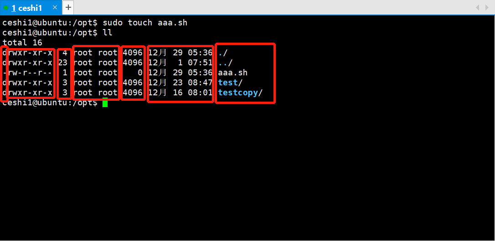

### 【linux基础】文件权限[链接](https://www.jianshu.com/p/ca8eed78214b)

* 查看当前登录用户: whomi

> whoami该命令用户查看当前系统当前账号的用户名。可通过cat /etc/passwd查看系统用户信息。
>
> 由于系统管理员通常需要使用多种身份登录系统，例如通常使用普通用户登录系统，然后再以su
> 命令切换到root身份对传统进行管理。这时候就可以使用whoami来查看当前用户的身份。

```markdown
ceshi1@ubuntu:/$ whoami
ceshi1
```

* 添加用户: useradd
> 在Linux中添加用户账号可以使用useradd命令，useradd命令的使用格式如下:
>
> useradd [参数] 新建用户账号

| 参数   |      含义      
|----------|:-------------:
|  useradd -d   |   指定用户登录系统时的主目录，如果不使用该参数，系统自动在/home目录下建立与用户名同名目录为主目录
|  useradd -m   |   自动建立目录
|  useradd -g   |   指定组名称

##### 注意：
* Linux每个用户都要有一个主目录，主目录就是第一次登陆系统，用户的默认当前目录(/home/用户)；
* 每一个用户必须有一个主目录，所以用useradd创建用户的时候，一定给用户指定一个主目录；
* 用户的主目录一般要放到根目录的home目录下，用户的主目录和用户名是相同的；
* 如果创建用户的时候，不指定组名，那么系统会自动创建一个和用户名一样的组名。

```shell script
useradd -d /home/awen awen -m

创建awen用户，如果/home/awen目录不存在，就自动创建这个目录，同时用户属于awen组
```

```shell script
useradd -d /home/awen awen -g zhiliao -m 

创建一个用户名为awen,主目录在/home/awen,如果主目录不存在就创建主目录，同时用户属于zhiliao组
```

##### 示例：
* 创建awen用户同时用户属于awen组
* 修改awen用户密码

```shell script
ceshi1@ubuntu:/$ sudo useradd -d /home/awen awen -m
ceshi1@ubuntu:/$ cd /home
ceshi1@ubuntu:/home$ ll
total 16
drwxr-xr-x  4 root   root   4096 12月 29 05:31 ./
drwxr-xr-x 23 root   root   4096 12月  1 07:51 ../
drwxr-xr-x  2 awen   awen   4096 12月 29 05:31 awen/
drwxr-xr-x 23 ceshi1 ceshi1 4096 12月 29 05:16 ceshi1/

ceshi1@ubuntu:/home$ sudo passwd awen
Enter new UNIX password: ceshi1
Retype new UNIX password: ceshi1
passwd: password updated successfully
```

* 文件描述:



* 文件描述
    * 1.文件或目录，d表示：目录, -为文件
    * 2.文件权限(以第一组示例说明)
        * rwx: 文件所有者
        * r-x: 同组用户
        * r-x: 其他用户
    * 3.硬链接数量
    * 4.文件所有者
    * 5.文件大小
        * 4096目录本身大小，并不代表目录内内容文件大小
    * 6.创建、更新日期
    * 7.文件名、目录名
    
* 修改文件权限：chmod
> chmod --修改文件权限

```shell script
root@ubuntu:/opt# chmod 700 aaa.sh
root@ubuntu:/opt# su ceshi1
ceshi1@ubuntu:/opt$ cat aaa.sh
cat: aaa.sh: Permission denied
```
* 两种写法
```shell script
chmod [-R] <a|u|g|o> +-= rwx- /<path>/filename
chmod [-R] 755 /<path>/filename
```

| 参数   |      含义      
|----------|:-------------:
|  u   |   user表示该文件的所有者
|  g   |   group表示该文件的所属组，用户组
|  o   |   other 表示其他人 就是就是任何人
|  a   |   all表示三者都给权限

| 参数   |      含义      
|----------|:-------------:
|  +   |   增加权限
|  -   |   撤销权限
|  =   |   设定权限

* 增加文件权限
```shell script
root@ubuntu:/opt# chmod +r aaa.sh
root@ubuntu:/opt# ll
total 20
drwxr-xr-x  4 root root 4096 12月 29 06:36 ./
drwxr-xr-x 23 root root 4096 12月  1 07:51 ../
-rwxr--r--  1 root root   24 12月 29 06:36 aaa.sh*
drwxr-xr-x  3 root root 4096 12月 23 08:47 test/
drwxr-xr-x  3 root root 4096 12月 16 08:01 testcopy/
root@ubuntu:/opt# su ceshi1
ceshi1@ubuntu:/opt$ cat aaa.sh
aa
bbb
ccc
ddd
dddd
eee
```

* 修改目录权限
```shell script
root@ubuntu:/opt# mkdir testdir
root@ubuntu:/opt# cd testdir
root@ubuntu:/opt/testdir# touch aaa bbb ccc ddd
root@ubuntu:/opt/testdir# ll
total 8
drwxr-xr-x 2 root root 4096 12月 29 07:23 ./
drwxr-xr-x 5 root root 4096 12月 29 07:22 ../
-rw-r--r-- 1 root root    0 12月 29 07:23 aaa
-rw-r--r-- 1 root root    0 12月 29 07:23 bbb
-rw-r--r-- 1 root root    0 12月 29 07:23 ccc
-rw-r--r-- 1 root root    0 12月 29 07:23 ddd
root@ubuntu:/opt/testdir# cd ../
root@ubuntu:/opt# chmod 700 testdir
root@ubuntu:/opt# ll
total 24
drwxr-xr-x  5 root root 4096 12月 29 07:22 ./
drwxr-xr-x 23 root root 4096 12月  1 07:51 ../
-rwxr--r--  1 root root   24 12月 29 06:36 aaa.sh*
drwxr-xr-x  3 root root 4096 12月 23 08:47 test/
drwxr-xr-x  3 root root 4096 12月 16 08:01 testcopy/
drwx------  2 root root 4096 12月 29 07:23 testdir/
root@ubuntu:/opt# su ceshi1
ceshi1@ubuntu:/opt$ ll
total 24
drwxr-xr-x  5 root root 4096 12月 29 07:22 ./
drwxr-xr-x 23 root root 4096 12月  1 07:51 ../
-rwxr--r--  1 root root   24 12月 29 06:36 aaa.sh*
drwxr-xr-x  3 root root 4096 12月 23 08:47 test/
drwxr-xr-x  3 root root 4096 12月 16 08:01 testcopy/
drwx------  2 root root 4096 12月 29 07:23 testdir/
ceshi1@ubuntu:/opt$ cd testdir
bash: cd: testdir: Permission denied
```

* 增加目录权限

```shell script
root@ubuntu:/opt# chmod 777 testdir
root@ubuntu:/opt# ll
total 24
drwxr-xr-x  5 root root 4096 12月 29 07:22 ./
drwxr-xr-x 23 root root 4096 12月  1 07:51 ../
-rwxr--r--  1 root root   24 12月 29 06:36 aaa.sh*
drwxr-xr-x  3 root root 4096 12月 23 08:47 test/
drwxr-xr-x  3 root root 4096 12月 16 08:01 testcopy/
drwxrwxrwx  2 root root 4096 12月 29 07:23 testdir/

root@ubuntu:/opt# su ceshi1
ceshi1@ubuntu:/opt$ cd testdir
ceshi1@ubuntu:/opt/testdir$ ll
total 8
drwxrwxrwx 2 root root 4096 12月 29 07:23 ./
drwxr-xr-x 5 root root 4096 12月 29 07:22 ../
-rw-r--r-- 1 root root    0 12月 29 07:23 aaa
-rw-r--r-- 1 root root    0 12月 29 07:23 bbb
-rw-r--r-- 1 root root    0 12月 29 07:23 ccc
-rw-r--r-- 1 root root    0 12月 29 07:23 ddd
```

* rwx

| 参数   |      含义      
|----------|:-------------:
|  r   |   read 表示可读取，对于一个目录，如果没有r权限，那么就意味着不能通过ls查看这个目录的内容。就是不能读取这个文件
|  w   |   write 表示可写入，对于一个目录，如果没有w权限，那么就意味着不能在目录下创建新的文件。如果对文件没有w权限就不能修改文件
|  x   |   excute 表示可执行，对于一个目录，如果没有x权限，那么就意味着不能通过cd进入这个目录。如果是一个脚本就不能运行

| 数字表示   |      说明      
|----------|:-------------:
|  r   |   读取权限，数字可使用'4'
|  w   |   写入权限，数字可使用'2'
|  x   |   执行权限，数字代号为'1'
|  -   |   不具备任何权限，数字代号为'0'

##### 示例：
```shell script
chmod u=rwx,g=rx,o=rx filename 就等同于：chmod u=7,g=5,o=5 filename
chmod 755 file：
```
##### 说明
* u: 文件所有者
    * 7 => r w x
* g：同组用户
    * 5 => r x
* o: 其他用户
    * 5 => r x
  
* 修改文件所有者: chown
> 将aaa.sh 原属于root账户，root组
>
> 修改为：ceshi1账户，ceshi1组

```shell script
root@ubuntu:/opt# chmod 777 aaa.sh
root@ubuntu:/opt# ll
total 24
drwxr-xr-x  5 root root 4096 12月 29 07:22 ./
drwxr-xr-x 23 root root 4096 12月  1 07:51 ../
-rwxrwxrwx  1 root root   24 12月 29 06:36 aaa.sh*
drwxr-xr-x  3 root root 4096 12月 23 08:47 test/
drwxr-xr-x  3 root root 4096 12月 16 08:01 testcopy/
drwxrwxrwx  2 root root 4096 12月 29 07:23 testdir/

ceshi1@ubuntu:/opt$ sudo chown ceshi1:ceshi1 aaa.sh
ceshi1@ubuntu:/opt$ ll
total 24
drwxr-xr-x  5 root   root   4096 12月 29 07:22 ./
drwxr-xr-x 23 root   root   4096 12月  1 07:51 ../
-rwxrwxrwx  1 ceshi1 ceshi1   24 12月 29 06:36 aaa.sh*
drwxr-xr-x  3 root   root   4096 12月 23 08:47 test/
drwxr-xr-x  3 root   root   4096 12月 16 08:01 testcopy/
drwxrwxrwx  2 root   root   4096 12月 29 07:23 testdir/
```
        