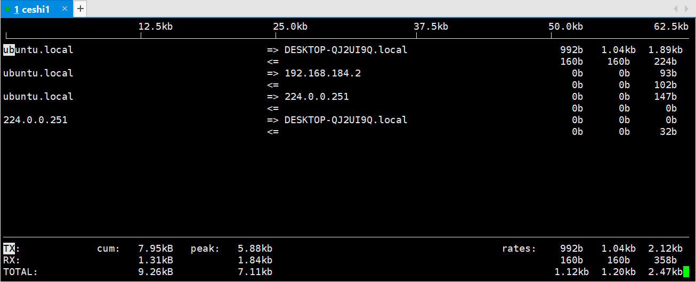
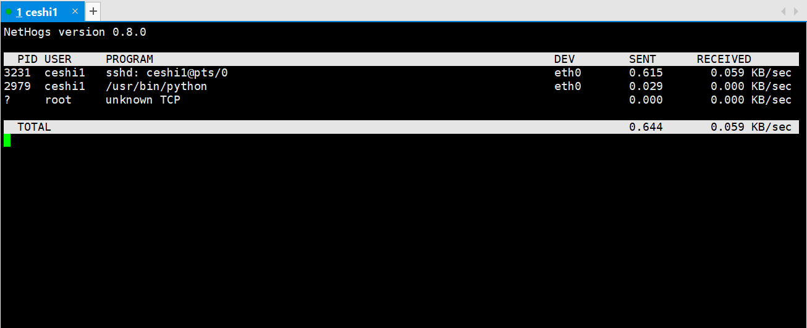

### 【linux基础】Linux常用命令(iftop,nethogs)(查看流量)[链接](http://wangkaixiang.cn/python-linux/di-si-jie-ff1a-linux-shi-yong-ming-ling.html)

#### 查看流量(网卡流量用于检查应用程序使用流量情况)

##### iftop
> 查看网卡流量使用 不能查询具体的应用程序使用了多少流量



##### nethogs
> 查看进程使用了具体的流量 可以查出程序的PID 用法 nethogs eth0(如果外网流量大就填外网，如果内网流量大就填内网) 
> 
> 通过pid使用 `ps axu` 和 `lsof` 查出进程 以及程序文件里面什么问题造成的

##### 未安装`nethogs`, 通过`aptitude search nethogs`命令搜索后，安装``
```shell script
root@ubuntu:/home/ceshi1# aptitude search nethogs
p   nethogs                                            - Net top tool grouping bandwidth per process                 
root@ubuntu:/home/ceshi1# apt-get install nethogs
......
```



##### 通过pid进行进程查询
```shell script
ceshi1@ubuntu:~$ ps axu |grep 2979
ceshi1    2979  0.0  0.7 100964 15816 ?        Sl   Jan03   0:00 /usr/bin/python /usr/lib/unity-scope-video-remote/unity-scope-video-remote
ceshi1    8557  0.0  0.0   5824   860 pts/1    S+   00:43   0:00 grep --color=auto 2979
```
```shell script
ceshi1@ubuntu:~$ ps axu |grep 8453
ceshi1    8453  0.0  0.0  10136  1632 ?        S    00:42   0:00 sshd: ceshi1@pts/1  
ceshi1    8562  0.0  0.0   5820   856 pts/1    S+   00:46   0:00 grep --color=auto 8453
```
