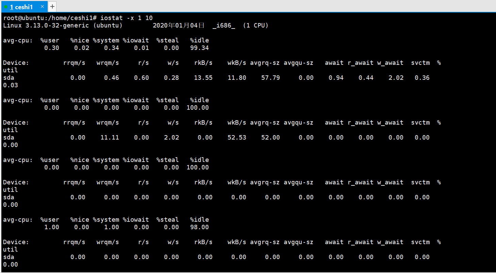
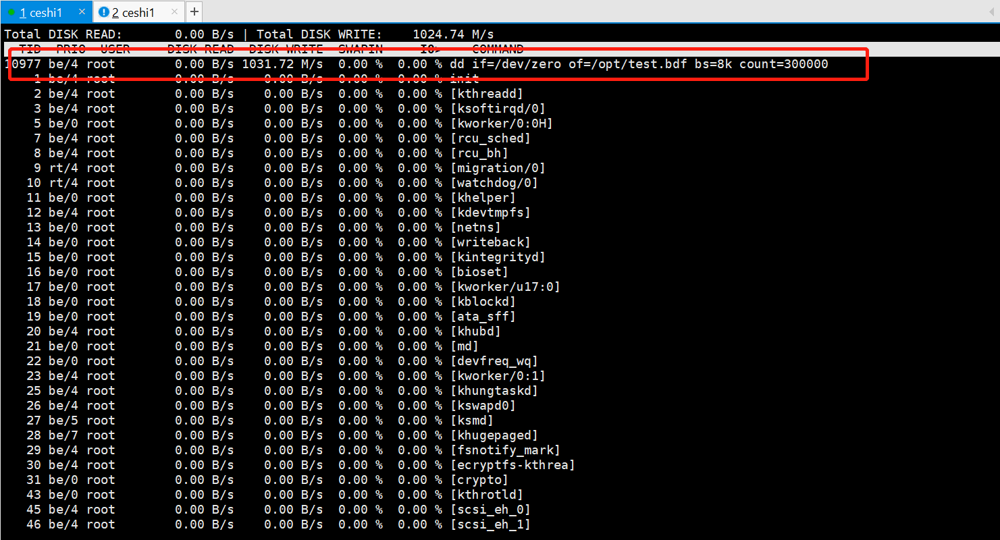

### 【linux基础】Linux常用命令(iotop,iostat)(查看磁盘读写)[链接](http://wangkaixiang.cn/python-linux/di-si-jie-ff1a-linux-shi-yong-ming-ling.html)

### 查看磁盘读写

#### 1.iostat -x 1 10
> 查看当前磁盘读写 只能查看全局不能查看具体的程序使用了多少IO



#### 2.iotop 
> 找出使用io最高的应用程序
##### 2.1 新建bbb.sh脚本
```shell script
#!/bin/bash
for i in $(seq 1 30)
do
	dd if=/dev/zero of=/opt/test.bdf bs=8k count=300000
	sleep 1
	rm -fr /opt/test.bdf
done
```

##### 2.2 启动shell脚本
```shell script
ceshi1@ubuntu:/opt$ sudo sh bbb.sh
300000+0 records in
300000+0 records out
2457600000 bytes (2.5 GB) copied, 2.19444 s, 1.1 GB/s
300000+0 records in
300000+0 records out
2457600000 bytes (2.5 GB) copied, 2.12284 s, 1.2 GB/s
300000+0 records in
300000+0 records out
......
```

##### 2.3 查看io最高应用程序



##### 2.4 根据消耗读写性能代码，查找原文件，并找到执行该命令父进程
```shell script
dd if=/dev/zero of=/opt/test.bdf bs=8k count=300000

root@ubuntu:/opt# ps axu |grep dd
......
root     11234 48.5  0.0   5816   588 pts/2    R+   07:07   0:00 dd if=/dev/zero of=/opt/test.bdf bs=8k count=300000
......
```

##### 2.5 查找父进程, 根据进程ID杀死进程
```shell script
root@ubuntu:/opt# iotop
root@ubuntu:/opt# ps -ef |grep dd
......
root     11512 11487 56 07:14 pts/2    00:00:01 dd if=/dev/zero of=/opt/test.bdf bs=8k count=300000
......
root@ubuntu:/opt# kill 11487
```