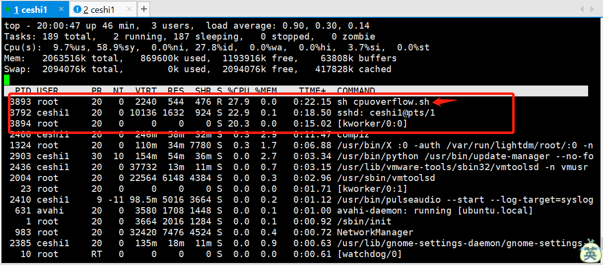
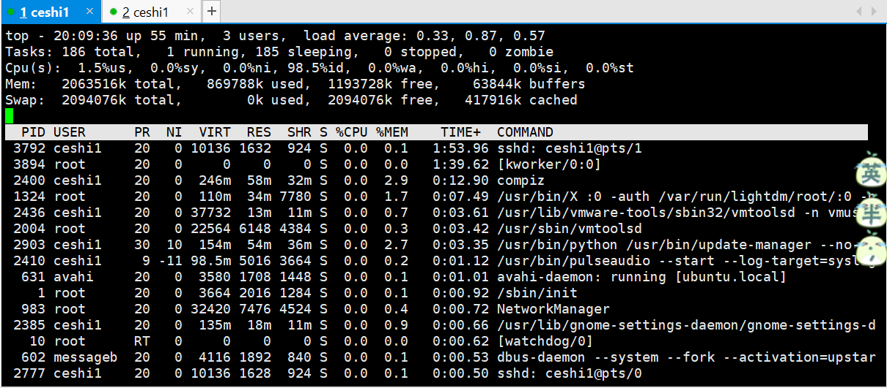

### 【linux基础】Linux常用命令(ss,lsof)[链接](http://wangkaixiang.cn/python-linux/di-si-jie-ff1a-linux-shi-yong-ming-ling.html)

### ss
> 能够快速的显示活动状态的套接字信息 和netstat的功能一模一样， 但是当你服务器的socket连接数量非常大的时候，
> 使用netstat就是浪费你的生命 ss最大的优势就是他比netstat快很多 

##### 常用命令
| 命令   |      含义      
|----------|:-------------:
|  ss -t -a   |   显示ICP连接
|   ss -s   |   显示sockets 摘要
|   ss -l   |   列出所有打开的网络连接端口
|   ss -pl   |   查看进程使用的socket
|   ss -pl &#124;grep nginx(应用名)   |   找出套接字/端口应用程序
|   ss -u -a   |   显示所有的UDP sockets,查看由多少个用户通过TCP或者其他的协议连接我的服务器

##### ss -t -a
> 显示ICP连接
```shell script
root@ubuntu:/home/ceshi1# ss -t -a
State       Recv-Q Send-Q       Local Address:Port           Peer Address:Port   
LISTEN      0      5                127.0.0.1:domain                    *:*       
LISTEN      0      128                      *:ssh                       *:*       
LISTEN      0      128                     :::ssh                      :::*       
LISTEN      0      128              127.0.0.1:ipp                       *:*       
LISTEN      0      128                    ::1:ipp                      :::*       
ESTAB       0      64         192.168.184.128:ssh           192.168.184.1:52524   
CLOSE-WAIT  1      0          192.168.184.128:46889          91.189.94.25:http    
```

##### ss -s
> 显示sockets 摘要
```shell script
root@ubuntu:/home/ceshi1# ss -s
Total: 569 (kernel 588)
TCP:   9 (estab 1, closed 0, orphaned 0, synrecv 0, timewait 0/0), ports 0

Transport Total     IP        IPv6
*	  588       -         -        
RAW	  0         0         0        
UDP	  6         4         2        
TCP	  9         7         2        
INET	  15        11        4        
FRAG	  0         0         0 
```

##### ss -l
> 列出所有打开的网络连接端口
```shell script
root@ubuntu:/home/ceshi1# ss -l
State       Recv-Q Send-Q       Local Address:Port           Peer Address:Port   
LISTEN      0      5                127.0.0.1:domain                    *:*       
LISTEN      0      128                      *:ssh                       *:*       
LISTEN      0      128                     :::ssh                      :::*       
LISTEN      0      128              127.0.0.1:ipp                       *:*       
LISTEN      0      128                    ::1:ipp                      :::*       
```

##### ss -pl
> 查看进程使用的socket
```shell script
root@ubuntu:/home/ceshi1# ss -pl
State       Recv-Q Send-Q       Local Address:Port           Peer Address:Port   
LISTEN      0      5                127.0.0.1:domain                    *:*        users:(("dnsmasq",1628,5))
LISTEN      0      128                      *:ssh                       *:*        users:(("sshd",580,4))
LISTEN      0      128                     :::ssh                      :::*        users:(("sshd",580,3))
LISTEN      0      128              127.0.0.1:ipp                       *:*        users:(("cupsd",655,9))
LISTEN      0      128                    ::1:ipp                      :::*        users:(("cupsd",655,8))
```

##### ss -pl |grep 应用名
> 找出套接字/端口应用程序
```shell script
root@ubuntu:/home/ceshi1# ss -pl |grep users
LISTEN     0      5               127.0.0.1:domain                   *:*        users:(("dnsmasq",1628,5))
LISTEN     0      128                     *:ssh                      *:*        users:(("sshd",580,4))
LISTEN     0      128                    :::ssh                     :::*        users:(("sshd",580,3))
LISTEN     0      128             127.0.0.1:ipp                      *:*        users:(("cupsd",655,9))
LISTEN     0      128                   ::1:ipp                     :::*        users:(("cupsd",655,8))
```

##### ss -u -a
> 显示所有的UDP sockets,查看由多少个用户通过TCP或者其他的协议连接我的服务器
```shell script
root@ubuntu:/home/ceshi1# ss -u -a
State       Recv-Q Send-Q       Local Address:Port           Peer Address:Port   
UNCONN      0      0                        *:mdns                      *:*       
UNCONN      0      0                        *:60283                     *:*       
UNCONN      0      0                127.0.0.1:domain                    *:*       
UNCONN      0      0                        *:bootpc                    *:*       
UNCONN      0      0                       :::mdns                     :::*       
UNCONN      0      0                       :::43134                    :::*       
```

### lsof
> 查看当前被使用的文件 lsof功能一般结合ps 工具一起使用可以查询正在执行的文件和脚本

##### 1. 新建`cpuoverflow.sh` shell脚本文件
```shell script
root@ubuntu:/opt# touch cpuoverflow.sh
root@ubuntu:/opt# chmod 777 cpuoverflow.sh

zhiliao@ubuntu:/opt$ cat cpuoverflow.sh
#!bin/bash
while true
do
	echo 'hello world!'
done
```

##### 2.启动shell脚本
```shell script
zhiliao@ubuntu:/opt$ sudo sh cpuoverflow.sh
hello world!
......
```

##### 3.使用`top`命令查看消耗最多CPU的进程


##### 4.使用`lsof |grep cpuoverflow.sh`查找文件所在位置
> 文件所处位置: /opt/cpuoverflow.sh
```shell script
root@ubuntu:/opt# lsof |grep cpuoverflow.sh
lsof: WARNING: can't stat() fuse.gvfs-fuse-daemon file system /home/ceshi1/.gvfs
      Output information may be incomplete.
sh        3893       root   10r      REG        8,1       51     681256 /opt/cpuoverflow.sh
```

##### 5.杀死进程，删除非法脚本
```shell script
root@ubuntu:/opt# ps -ef |grep 3893
root      3893  3892 26 19:59 pts/1    00:02:14 sh cpuoverflow.sh
root      3919  3379  0 20:07 pts/0    00:00:00 grep --color=auto 3893
root@ubuntu:/opt# kill 3893
root@ubuntu:/opt# rm -fr /opt/cpuoverflow.sh
root@ubuntu:/opt# ll
total 2400032
drwxr-xr-x  5 root root       4096  1月  4 20:12 ./
drwxr-xr-x 23 root root       4096 12月  1 07:51 ../
-rw-r--r--  1 root root         27  1月  2 07:13 aaa.sh
-rwxrwxrwx  1 root root        125  1月  4 07:17 bbb.sh*
drwxr-xr-x  3 root root       4096  1月  2 07:48 test/
-rw-r--r--  1 root root 2457600000  1月  4 07:18 test.bdf
drwxr-xr-x  3 root root       4096 12月 16 08:01 testcopy/
drwxrwxrwx  2 root root       4096 12月 29 07:23 testdir/
```

