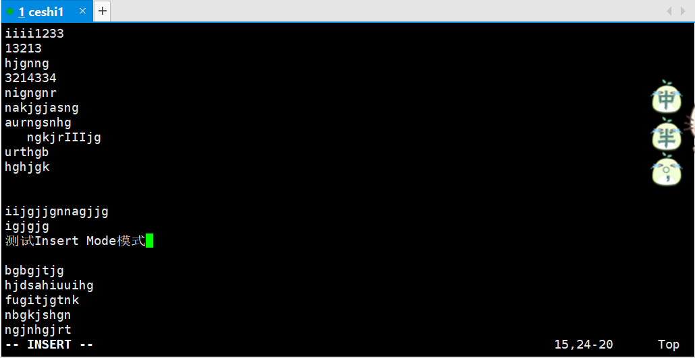

### 【linux基础】VIM介绍三种模式[链接](https://www.jianshu.com/p/4835b2d1234e)

### VIM模式

* VIM主要的模式有3个

#### 1.Normal Mode
> 字面意思就是普通模式,VIM在启动后就是在普通模式，在这个模式下你的操作是
> 命令VIM帮助你完成某个动作。
>
> 键盘按下h: 向左移动一个字符
>
> 键盘按下j: 向下换一行
>
> 键盘按下k: 向上换一行
>
> 键盘按下L: 向右移动一个字符
>
> shift+: 切换到输入模式，输入12回车跳转到12行
>
> shift+: 切换到输入模式，输入q，回车退出普通模式

##### shift+: 切换到输入模式，输入12回车跳转到12行


##### shift+: 切换到输入模式，输入q，回车退出普通模式
```shell script
root@ubuntu:/opt# vim vimtest
....
giutghi
:q
```

#### 2.Insert Mode
> 插入模式，在这个模式下我们可以对文本进行增删改来操作


#### 3.Visual Mode
> 可视模式,在这个模式下可以选中某个区域来做一些操作，
> 这个模式可以视为局部的Normal Mode
>
> v：进入Visual mode，选取以字符为单位
>
> V：进入Visual mode，选取以行为单位

##### v：进入Visual mode，选取以字符为单位
> vim 文件名，进入普通模式后
>
> 按下键盘v键，进入Visual mode模式，选取以字符为单位


##### V：进入Visual mode，选取以行为单位
> vim 文件名，进入普通模式后
>
> 按下键盘大写V键，进入Visual mode模式，选取以行为单位


### 模式的切换


#### Normal mode 切换到 Insert mode
```shell script
i：进入Insert mode，并且让光标处于当前字符之前
I：进入Insert mode，并且光标处于当前行的第一个非空字符前
a：进入Insert mode，并且光标处于当前字符之后
A：进入Insert mode， 并且光标处于当前行尾
o：进入Insert mode，并在当前行后新起一行，光标位于新行
O：进入Insert mode，并在当前行上边插入新行，光标位于新行
s：删除当前字符，然后进入Insert mode
S：删除当前行，然后进入Insert mode
```

#### Insert mode 切换到 Normal mode
```shell script
键盘按下，<ESC>按键
```

#### Normal mode 切换到Visual mode
```shell script
v(小写)：进入Visual mode，选取以字符为单位
V(大写)：进入Visual mode，选取以行为单位
```

#### Visual mode 切换到Normal mode
```shell script
键盘按下，<ESC>按键
```