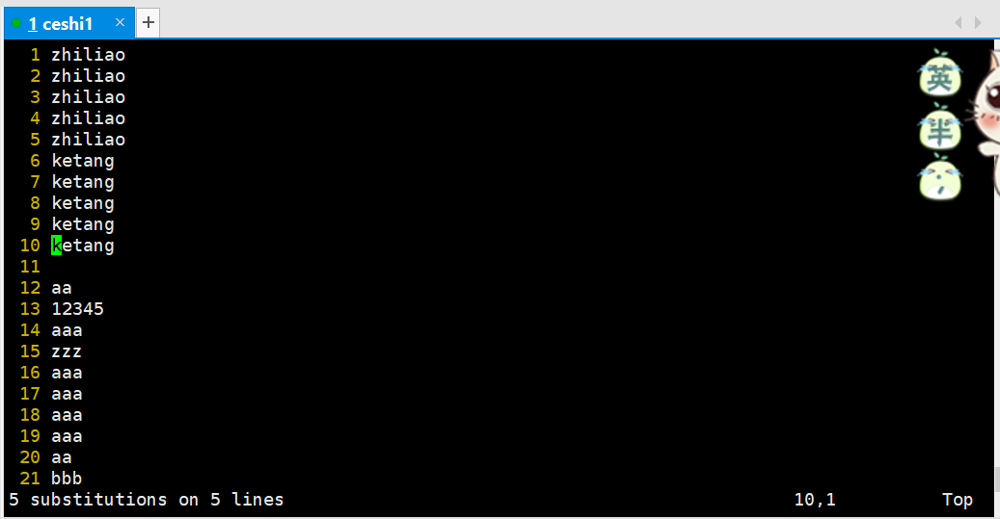

### 【linux基础】VIM基本操作[链接](https://www.jianshu.com/p/4835b2d1234e)

### 末行模式

> 末行模式也称ex转义模式。在命令模式下，用户按“:”键即可进入末行模式下，
> 此时Vi会在显示窗口的最后一行(通常也是屏幕的最后一行)显示一个“:”作为末行模式的提示符，
> 等待用户输入命令。多数文件管理命令都是在此模式下执行的(如把编辑缓冲区的内容写到文件中等)。
> 末行命令执行完后，Vi自动回到命令模式。


### VIM基本操作

#### 普通模式
```shell script
移动光标
h: 左移 

j: 下移 

k: 上移 

l: 右移

M: 光标移动到中间行 

L: 光标移动到屏幕最后一行行首 

G: 移动到指定行,行号 -G
    10G => 移动到第10行
    1G =>  移动到第一行

w: 向后一次移动一个字 

b: 向前一次移动一个字

{: 按段移动,上移 
  shift + {

}: 按段移动,下移
  shift + }

Ctr-d: 向下翻半屏 

Ctr-u: 向上翻半屏

Ctr-f: 向下翻一屏 

Ctr-b: 向上翻一屏

gg: 光标移动文件开头 

G: 光标移动到文件末尾
```

#### 删除模式
```shell script
x: 删除光标后一个字符,相当于 Del 

X: 删除光标前一个字符,相当于 Backspace

dd: 删除光标所在行,n dd 删除指定的行数 D: 删除光标后本行所有内容,包含光标所在字符 

d0(不会用): 删除光标前本行所有内容,不包含光标所在字符

dw: 删除光标开始位置的字,包含光标所在字符
```

#### 撤销命令
```shell script
u: 一步一步撤销 
Ctr-r: 反撤销(不会用)
```

#### 重复命令(不会用)
```shell script
.: 重复上一次操作命令
```

#### 文本行移动
```shell script
>>: 文本行右移 
  英文输入法下：shift + 两次>
<<: 文本行左移
  英文输入法下: shift + 两次<
```

#### 复制粘贴
```shell script
yy: 复制当前行,n yy 复制 n 行 
p: 在光标所在位置向下新开辟一行,粘贴

键盘按两下y字母复制，p粘贴
```

#### 可视模式
```shell script
v: 按字符移动,选中文本 

V: 按行移动,选中文本可视模式可以配合 d, y, >>, << 实现对文本块的删除,复制,左右移动
```

##### 可视v模式，基础模式下`按下v即可切换至可视v模式`


##### 可视V模式，基础模式下`按下V即可切换至可视V模式`


#### 替换操作
```shell script
r: 替换当前字符 
R: 替换当前行光标后的字符
```

##### R: 替换当前光标后的字符


#### 查找命令
```shell script
/: str查找
n: 下一个
N：上一个
```

##### 普通模式下直接输入`/关键字`回车开始查找


#### 替换命令
```shell script
把abc全部替换成123
末行模式下，将光标所在行的abc替换成123
:%s/abc/123/g

末行模式下，将第一行至第10行之间的abc替换成123
:1, 10s/abc/123/g
```

##### 替换从第1行到第5行替换，先`shift+:`后，输入:`1,5s/abc/zhiliao/g`后回车


##### 把abc全部替换成ketang，先`shift+:`后，输入`:%s/abc/ketang`后回车




#### vim里执行 shell 下命令
```shell script
shift + : 切换为末行模式后，再输入命令后回车

末行模式里输入!,后面跟命令
```


