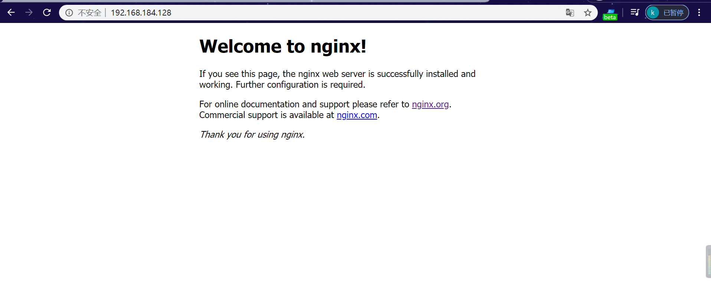

### 【linux基础】lnmp(nginx安装)[链接](https://www.jianshu.com/p/caa57355175a)

### nginx安装
* 1.rpm包安装
    * 官方的rpm包安装
    * 自己写一个rpm包
* 2.源码安装

#### 源码安装
* configure `配置`
    > 指定了我们的安装路径
* make      `编译`
    > 把源码文件编译成二进制文件
* make install `安装`
    > 把编译好的二进制文件 拷贝到我们的安装目录


#### 1. [nginx.org](http://nginx.org/)下载[最新稳定版源码包](http://nginx.org/en/download.html)
```
nginx-1.16.1.tar
```

#### 2. 上传至虚拟机后进行安装包解压
> rz -bye
>
> tar xvf nginx-1.16.1.tar.gz 
```
root@ubuntu:/opt# ll
total 8
drwxr-xr-x  2 root root 4096  1月 23 21:51 ./
drwxr-xr-x 23 root root 4096 12月  1 07:51 ../
root@ubuntu:/opt# mkdir nginx
root@ubuntu:/opt# cd nginx
[root@vultr nginx]# yum -y install lrzsz
[root@vultr nginx]# rz -bye
[root@vultr nginx]# tar xvf nginx-1.16.1.tar.gz 
[root@vultr nginx]# ll
total 1016
drwxr-xr-x 8 1001 1001    4096 Aug 13 12:51 nginx-1.16.1
-rw-r--r-- 1 root root 1032630 Jan 24 05:47 nginx-1.16.1.tar.gz
```


#### 3.安装`pcre-devel`和`zlib-devel`模块
> pcre可以使nginx支持http-rewrite模块

##### Centos
```
[root@vultr nginx]# yum -y install pcre-devel  zlib-devel
```

##### Ubuntu
```
root@ubuntu:/opt/nginx# apt-get install zlib1g.dev
root@ubuntu:/opt/nginx# apt-get install libpcre3 libpcre3-dev
```

#### 4.安装完成后进入`nginx目录`，修改配置项
> `./configure --with-http_stub_status_module --prefix=/usr/local/service/nginx --with-http_gzip_static_module` 
```
[root@vultr nginx]# ll
total 1016
drwxr-xr-x 8 1001 1001    4096 Aug 13 12:51 nginx-1.16.1
-rw-r--r-- 1 root root 1032630 Jan 24 05:47 nginx-1.16.1.tar.gz
[root@vultr nginx]# cd nginx-1.16.1
[root@vultr nginx-1.16.1]# ls
auto  CHANGES  CHANGES.ru  conf  configure  contrib  html  LICENSE  man  README  src
[root@vultr nginx-1.16.1]# ./configure --with-http_stub_status_module --prefix=/usr/local/service/nginx --with-http_gzip_static_module
```

#### 5.查看上条命令是否执行成功
> 返回`0`即代表成功。
```
[root@vultr nginx-1.16.1]# echo $?
0
```

#### 6.安装及编译软件包
> `make && make install`
```
[root@vultr nginx-1.16.1]# make && make install
[root@vultr nginx-1.16.1]# echo $?
0
```

#### 7.启动`nginx`
* 1.cd 到`--prefix=/usr/local/service/nginx`配置项中`/usr/local/service/nginx`目录
* 2.cd 到 `sbin`后，启动nginx服务`(./nginx)`
```
[root@vultr usr]# cd /usr/local/service/nginx
[root@vultr nginx]# ll
total 16
drwxr-xr-x 2 root root 4096 Jan 24 06:24 conf
drwxr-xr-x 2 root root 4096 Jan 24 06:24 html
drwxr-xr-x 2 root root 4096 Jan 24 06:24 logs
drwxr-xr-x 2 root root 4096 Jan 24 06:24 sbin
[root@vultr nginx]# cd sbin
[root@vultr sbin]# ./nginx
```

#### 8.启动成功后，访问`虚拟机addr`IP地址
> 例：`http://192.168.184.128/`



#### 9.新建`nginx`启动脚本
> 文件路径：`/etc/init.d/nginx`
>
> 给脚本执行权限`chmod +x nginx`
```
root@ubuntu:/opt# cd /etc/init.d
root@ubuntu:/etc/init.d# touch nginx
root@ubuntu:/etc/init.d# chmod +x nginx
root@ubuntu:/etc/init.d# ll |grep nginx
-rwxr-xr-x   1 root root     0  1月 23 23:16 nginx*
```

#### 10.编写`nginx`脚本
```
root@ubuntu:/etc/init.d# vim nginx
root@ubuntu:/etc/init.d# cat nginx
#!/bin/bash

case $1 in 
	'stop'|'STOP')
  	  /usr/local/service/nginx/sbin/nginx -s stop
	  echo 'nginx service stop!'
    ;;
	'start'|'START')
  	  /usr/local/service/nginx/sbin/nginx
	  echo 'nginx service start success!'
    ;; 
	'restart'|'RESTART')
  	  /usr/local/service/nginx/sbin/nginx -s stop
  	  /usr/local/service/nginx/sbin/nginx
	  echo 'nginx service restart success!' 
    ;;
	'reload'|'RELOAD')
  	  /usr/local/service/nginx/sbin/nginx -s reload
	  echo 'nginx service reload success!'
    ;;
    *)

	echo 'Usage:service nginx stop|restart|start|reload'
esac
```

#### 11.停止`nginx`服务
> `service nginx stop`
```
root@ubuntu:/# service nginx stop
root@ubuntu:/# ps axu |grep nginx
root     11069  0.0  0.0   5820   856 pts/1    S+   23:40   0:00 grep --color=auto nginx
```

#### 12.启动`nginx`服务
> `service nginx start`
```
root@ubuntu:/etc/init.d# ps axu |grep nginx
root     11054  0.0  0.0   5820   856 pts/1    S+   23:38   0:00 grep --color=auto nginx
root@ubuntu:/etc/init.d# cd /
root@ubuntu:/# service nginx start
root@ubuntu:/# ps axu |grep nginx
root     11059  0.0  0.0   3836   520 ?        Ss   23:39   0:00 nginx: master process /usr/local/service/nginx/sbin/nginx
nobody   11060  0.0  0.0   4056   912 ?        S    23:39   0:00 nginx: worker process              
root     11062  0.0  0.0   5820   856 pts/1    S+   23:39   0:00 grep --color=auto nginx
```

#### 13.重启`nginx`服务
> `service nginx restart`
```
root@ubuntu:/# service nginx restart
root@ubuntu:/# ps axu |grep nginx
root     11075  0.0  0.0   3836   516 ?        Ss   23:41   0:00 nginx: master process /usr/local/service/nginx/sbin/nginx
nobody   11076  0.0  0.0   4056   908 ?        S    23:41   0:00 nginx: worker process              
root     11082  0.0  0.0   5820   860 pts/1    S+   23:42   0:00 grep --color=auto nginx
```
