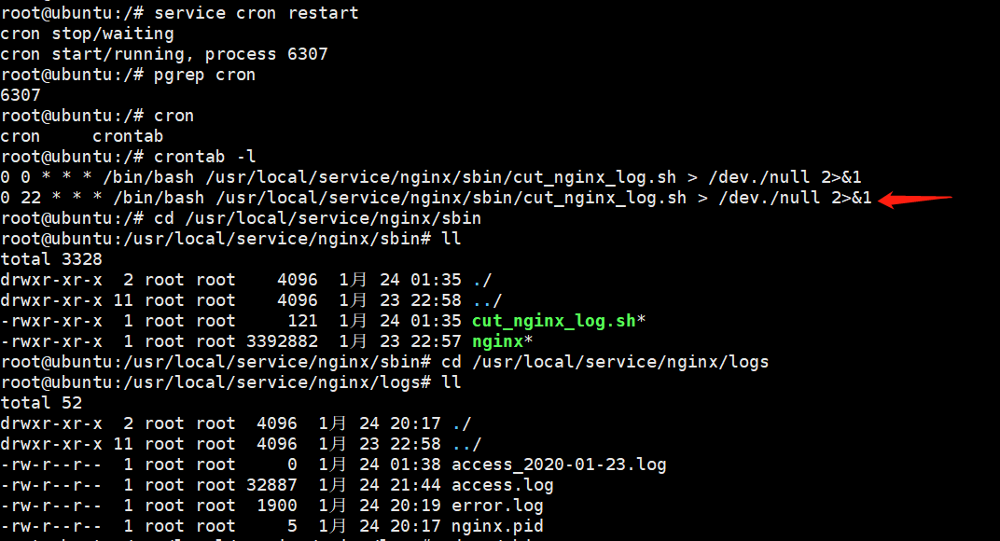

### 【linux基础】lnmp(nginx配置文件和日志分割)[链接](https://www.jianshu.com/p/caa57355175a)

### nginx启动与关闭

#### 检查语法
```
/usr/loacal/service/nginx/sbin/nginx -t
```

#### 平滑重启
> `/usr/local/service/sbin/nginx -s reload`
```
root@ubuntu:/usr/local/service/nginx/sbin# ./nginx -s reload
```

#### 不间断服务器重启，将pid行程重跑(restart)
```
kill -HUP cat /opt/nginx/logs/nginx.pid
```

#### 关闭
> `kill (nginx master进程号)`
>
> 如：`kill 11075`
```
root@ubuntu:/usr/local/service/nginx/sbin# ps axu |grep nginx
root     11075  0.0  0.0   3968  1176 ?        Ss   Jan23   0:00 nginx: master process /usr/local/service/nginx/sbin/nginx
nobody   11124  0.0  0.0   4136  1220 ?        S    01:04   0:00 nginx: worker process              
root     11130  0.0  0.0   5820   856 pts/1    S+   01:06   0:00 grep --color=auto nginx
root@ubuntu:/usr/local/service/nginx/sbin# kill 11075
```

### 扩展知识

#### 获取当前日期时间
> date 
```
root@ubuntu:/# date
2020年 01月 24日 星期五 01:09:00 PST
```

#### 获取当前日期年月日
> `date +%F`
```
root@ubuntu:/# date +%F
2020-01-24
```

#### 获取当前日期年月日-1天
> `date +%F -d -1day`
```
root@ubuntu:/# date +%F -d -1day
2020-01-23
```

### nginx日志脚本

#### 1.1 创建脚本`/usr/local/service/nginx/sbin/cut_nginx_log.sh`
```
root@ubuntu:/# cd /usr/local/service/nginx
root@ubuntu:/usr/local/service/nginx# ls
client_body_temp  conf  fastcgi_temp  html  logs  proxy_temp  sbin  scgi_temp  uwsgi_temp
root@ubuntu:/usr/local/service/nginx# cd sbin
root@ubuntu:/usr/local/service/nginx/sbin# touch cut_nginx_log.sh
root@ubuntu:/usr/local/service/nginx/sbin# chmod +x cut_nginx_log.sh
root@ubuntu:/usr/local/service/nginx/sbin# ll
total 3324
drwxr-xr-x  2 root root    4096  1月 24 01:11 ./
drwxr-xr-x 11 root root    4096  1月 23 22:58 ../
-rwxr-xr-x  1 root root       0  1月 24 01:11 cut_nginx_log.sh*
-rwxr-xr-x  1 root root 3392882  1月 23 22:57 nginx*
```

#### 1.2 编写`cut_nginx_log.sh` shell脚本
> 运行脚本`sh cut_nginx_log.sh`，生成示例：`access_2020-01-23.log`
>
> 解决`nginx: [error] open() /usr/local/nginx/logs/nginx.pid failed错误`
> `/usr/local/service/nginx/sbin/nginx -c /usr/local/service/nginx/conf/nginx.conf`

```
root@ubuntu:/usr/local/service/nginx/sbin# vim cut_nginx_log.sh
root@ubuntu:/usr/local/service/nginx/sbin# cat cut_nginx_log.sh
#!/bin/bash
cd /usr/local/service/nginx/logs  
/bin/mv access.log access_$(date +%F -d -1day).log  
service nginx reload
root@ubuntu:/usr/local/service/nginx/sbin# ls
cut_nginx_log.sh  nginx
root@ubuntu:/usr/local/service/nginx/sbin# sh cut_nginx_log.sh
root@ubuntu:/usr/local/service/nginx/sbin# cd ../logs
root@ubuntu:/usr/local/service/nginx/logs# ll
total 20
drwxr-xr-x  2 root root 4096  1月 24 01:39 ./
drwxr-xr-x 11 root root 4096  1月 23 22:58 ../
-rw-r--r--  1 root root    0  1月 24 01:38 access_2020-01-23.log
-rw-r--r--  1 root root  382  1月 24 01:39 access.log
-rw-r--r--  1 root root  616  1月 24 01:39 error.log
-rw-r--r--  1 root root    6  1月 24 01:38 nginx.pid
root@ubuntu:/usr/local/service/nginx/logs# ls
access_2020-01-23.log  access.log  error.log  nginx.pid
```

### `Ubuntu`设置定时任务`crontab`命令
> Ubuntu系统创建定时任务[链接](https://blog.csdn.net/frank_ldw/article/details/81219289)

#### `cron`服务的启动与停止
##### 在Ubuntu 9.10下，cron是被默认安装并启动的。而 ubuntu 下启动，停止与重启cron，均是通过调用/etc/init.d/中的脚本进行。命令如下：

* service cron start  `启动服务`
* service cron stop   `关闭服务`
* service cron restart  `重启服务`
* service cron reload   `重新载入配置`

##### 查看cron是否在运行（如果在运行，则会返回一个进程ID）
> `pgrep cron`
```
root@ubuntu:/etc/init.d# service cron stop
cron stop/waiting
root@ubuntu:/etc/init.d# pgrep cron
root@ubuntu:/etc/init.d# service cron start
cron start/running, process 5612
root@ubuntu:/etc/init.d# pgrep cron
5612
```

#### `crontab`命令
##### crontab 命令用于安装、删除或者列出用于驱动cron后台进程的表格。也就是说，用户把需要执行的命令序列放到crontab文件中以获得执行，每个用户都可以有自己的crontab文件。以下是这个命令的一些参数与说明：

* 1）crontab -u `设定某个用户的cron服务` 
* 2）crontab -l `列出某个用户cron服务的详细内容`
* 3）crontab -r `删除某个用户的cron服务`
* 4）crontab -e `编辑某个用户的cron服务`

| 命令   |      含义      
|----------|:-------------:
|  crontabl –l    |   显示用户的Crontab文件的内容
|  crontabl -ri    |   删除用户的Crontab文件前给提示
|  crontabl -r    |   从Crontab目录中删除用户的Crontab文件
|  crontabl -e    |   编辑用户的Crontab文件

#### 新增`cron任务`

#### 1.如遇：`no crontab for root - using an empty one`
> 处理[链接](https://www.cnblogs.com/We612/p/11235722.html)
* 1.`sudo su root`
* 2.`select-editor`后，选择：`3`
* 3.`crontab -e` 编写定时任务
```
ceshi1@ubuntu:~$ sudo su root
[sudo] password for ceshi1: 
root@ubuntu:/home/ceshi1# 
root@ubuntu:/home/ceshi1# select-editor

Select an editor.  To change later, run 'select-editor'.
  1. /bin/ed
  2. /bin/nano        <---- easiest
  3. /usr/bin/vim.basic
  4. /usr/bin/vim.tiny

Choose 1-4 [2]: 3
root@ubuntu:/home/ceshi1# crontab -e
no crontab for root - using an empty one

# Edit this file to introduce tasks to be run by cron.
# 
......
~                                                                                                
~                
```

#### 2.`crontab`添加到定时任务
> `0 0 * * *`: 每天00:00点执行任务
>
> `37 13 * * *`: 每天13:37分执行任务
```
root@ubuntu:/home/ceshi1# crontab -l
......
0 0 * * * /bin/bash /usr/local/service/nginx/sbin/cut_nginx_log.sh > /dev./null 2>&1
37 13 * * * /bin/bash /usr/local/service/nginx/sbin/cut_nginx_log.sh > /dev./null 2>&1
```

#### 3.添加完毕后，重启`cron`服务
```
root@ubuntu:/# service cron restart
cron stop/waiting
cron start/running, process 6236
```

#### 4.`crontab`定时任务执行结果



### `nginx`配置文件
> `conf`文件配置: `/usr/local/service/nginx/conf/nginx.conf`
```
Httpd.conf nginx.conf my-heavy-innode-4G.cnf php.ini 用中文注释  
### user:指定NginxWorker进程运行用户和用户组，默认nobody账号  
user nginx;  
grou nginx;  
### worker_processes:指定Nginx要开启的进程数，建议和cpu数量一样的  
worker_processes 1;  
error_log: 定义全局错误日志文件。日志有输出级别：  
[debug|info|notice|warn|error|crit]  
error_log /var/log/nginx/error.log info;  
### 进程文件  
pid /var/run/nginx.pid;  
#### 一个nginx进程打开的最多文件描述符数目，理论值应该是最多打开文件数（系统的值ulimit-n）与nginx进程数相除，但是nginx\分配请求并不均匀，所以建议与ulimit-n的值保持一致。  
worker_rlimit_nofile 65535;  
### 工作模式与连接数上限  
events  
{  
#参考事件模型，use[kqueue|rtsig|epol|/dev/poll|selec|poll];epoll模型是Linux2.6以上版本内核中的高性能网络I/O模型，如果跑在FreeBSD上面，就用kqueue模型。  
use epoll;#单个进程最大连接数（最大连接数=连接数*进程数）  
worker_connections 65535;  
}  
#### 设定服务器  
http  
{  
include mime.types;#文件拓展名和文件类型映射表  
default_type application/octet-stream;#默认文件类型  
charset utf-8;#默认编码  
server_names_hash_bucket_size 128;#服务器名字的bash表大小  
client_header_buffer_size 32k;#上传文件大小限制  
large_client_header_buffers 4 64k;  
client_max_body_size 8m;  
sendfile on; #开启高效文件传输模式  
autoindex on;#开启目录表访问，合适下载服务器，默认关闭  
tcp_nopush on; 防止网络阻塞  
tcp_nodelay on;#防止网络阻塞  
keepalive_timeout 120;# 长连接超时时间，单位是秒  
#### FastCGI相关参数是为了改善网站的性能：减少资源占用，提高访问速度。下面参数看字面意思都能理解。  
fastcgi_connect_timeout 300;  
fastcgi_send_timeout 300;  
fastcgi_read_timeout 300;  
fastcgi_buffer_size 64k;  
fastcgi_buffers 4 64k;  
fastcgi_busy_buffers_size 128k;  
fastcgi_temp_file_write_size 128k;  
#### gzip模块设置  
gzip on; #开启gzip压缩文件大小  
gzip_min_length 1k;#最小压缩文件大小  
gzip_buffers 4 16k;#压缩缓冲区  
gzip_http_version 1.0;#压缩版本  
gzip_comp_level 2; #压缩等级  
gzip_types text/plain application/x-javascrip text/css application/xml;  
#### 压缩类型，默认就已经包含text/html，所以下面就不用再写了，写上去也不会有问题，但是会有一个warn。  
gzip_vary on;  
limit_zone crawler $binary_remote_addr 10m;#开启限制IP连接数的时候需要使用  
upstream 90sec.blog.51cto.com{  
#### upstream的负载均衡，weight是权重，可以根据机器配置定义权重。weigth参数表示权值，权值越高被分配到的几率越大。  
server 192.168.80.121:80 weight=3;  
server 192.168.80.122:80 weight=2;  
server 192.168.80.123:80 weight=3;  
}  
#### 虚拟主机的配置  
server  
{  
#### 监听端口  
listen 80;  
#### 域名可以有多个，用空格隔开  
server_name www.90sec.com 90sec.com  
index index.html index.htm index.php;  
root /data/www/90sec  
location ~ .*.(php|php5)?$  
{  
fastcgi_pass 127.0.0.1:9000;  
fastcgi_index index.php;  
include fastcgi.conf;  
}  
#### 图片缓存时间设置  
location ~ .*.(gif|jpg|jpeg|png|bmp|swf)$  
{  
expires 10d;  
}  
#### JS和CSS缓存时间设置  
location ~ .*.(js|css)?$  
{  
expires 1h;  
}  
#### 日志格式设定  
log_format access '$remote_addr - $remote_user [$time_local] "$request"' '$status $body_bytes_sent" $http_referer"'  
'"$http_user_agent" $http_x_forwarded_for';  
#### 定义本虚拟主机的访问日志  
access_log /var/log/nginx/90secaccess.log access;  
#### 对"/" 启用反向代理  
location/{  
proxy_pass http://127.0.0.1:88;  
proxy_redirect off;  
proxy_set_header X-Real-IP $remote_addr;  
#### 后端的Web服务器可以通过X-Forwarded-For获取用户真实IP  
proxy_set_header X-Forwarded-For $proxy_add_x_forwarded_for;  
####  以下是一些反向代理的配置，可选。  
proxy_set_header Host $host;  
client_max_body_size 10m; #允许客户端请求的最大单文件字节数  
client_body_buffer_size 128k; #缓冲区代理缓冲用户端请求的最大字节数，  
proxy_connect_timeout 90;#nginx跟后端服务器连接超时时间(代理连接超时)  
proxy_send_timeout 90;#后端服务器数据回传时间(代理发送超时)  
proxy_read_timeout 90;#连接成功后，后端服务器响应时间(代理接收超时)  
proxy_buffer_size 4k; #设置代理服务器（nginx）保存用户头信息的缓冲区大小  
proxy_buffers 4 32k; #proxy_buffers 缓冲区，网页平均在32k以下的设置  
proxy_busy_buffers_size 64k;#高负荷下缓冲大小（proxy_buffers*2）  
proxy_temp_file_write_size 64k;#设定缓存文件夹大小，大于这个值，将从  
upstream服务器传}  
#### 设定查看Nginx状态的地址  
location /NginxStatus{  
stub_status on;  
access_log on;  
auth_basic "NginxStatus";  
auth_basic_user_file conf/htpasswd;  
#### htpasswd 文件的内容可以用 apache提供的htpasswd工具来产生。  
}  
#### 本地动静分离反向代理配置  
#### 所有jsp的页面均交由tomcat或resin处理  
location ~.(jsp|jspx|do)?${  
proxy_set_header Host $host;  
proxy_set_header X-Real-IP $remote_addr;  
proxy_set_header X-Forwarded-For $proxy_add_x_forwarded_for;  
proxy_pass http://127.0.0.1:8080;  
}  
#### 所有静态文件由nginx直接读取不经过tomcat或resin  
location  
~ .*.(htm|html|gif|jpg|jpeg|png|bmp|swf|ioc|rar|zip|txt|flv|mid|doc|ppt|pdf|xls|mp3|wma)$  
{ expires 15d;}  
location ~ .*.(js|css)?$  
{ expires 1h; }  
}}  
```