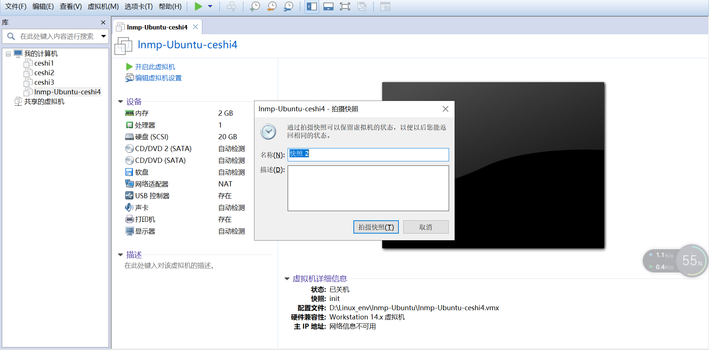

### 【linux基础】lnmp(HDWIKI搭建公司的知识管[链接](https://www.jianshu.com/p/2916a63f0137)

### 准备工作
#### 切换`163 yum源`[链接](http://mirrors.163.com/.help/centos.html)


### 1.新建一台虚拟机[链接](./342.md)

#### 1.1 关闭虚拟机后，进行初始化虚拟机快照


### 2.安装Mysql+PHP

#### 2.1 安装开发软件包
* 1.`yum -y groupinstall "Development Tools"`
* 2.`yum -y install libxml2* curl curl-devel libjpeg* libpng* libmcrypt* freetype-devel`
* 3.`yum -y install libmcrypt libmcrypt-devel`

```
[root@lnmp /]# yum -y groupinstall "Development Tools"
......
[root@lnmp /]# echo $?
0
[root@lnmp /]# yum -y install libxml2* curl curl-devel libjpeg* libpng* libmcrypt* freetype-devel 
......
[root@lnmp /]# echo $?
0
```

#### 2.2 下载PHP-5.6.2
> `No package xxx available.`错误[链接](https://blog.csdn.net/suleil1/article/details/78249824)
* `wget http://cn2.php.net/distributions/php-5.6.2.tar.gz`